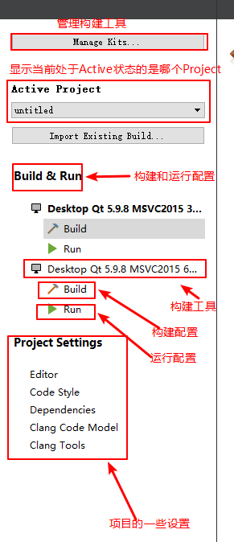

Qt Creator构建系统的设置
========================

Qt Creator的构建系统是建立在\ ``qmake``\ 和\ ``make``\ 基础之上的，设置Qt Creator的构建系统，本质上就是对\ ``qmake``\ 和\ ``make``\ 进行设置，只不过是以图形界面形式来完成的。

先介绍几个常用术语:

============= ====================================================================================================================================
术语          含义
============= ====================================================================================================================================
Auto-detected 如果在系统环境变量PATH中添加了Qt的安装路径，那么qmake将自动发现这个版本，成为Auto-detected Qt。
Shadow Build  影子构建模式，采用这种构建模式时，将在一个与项目源代码目录不同的目录下进行构建，而项目源代码目录将是\ *“干净"*\ 的，不会有任何改动。
============= ====================================================================================================================================

对一个项目的构建系统进行设置，需要先切换到\ *Project*\ 模式。

-  选择构建工具

-  默认情况下，每个构建工具有：Debug，Profile和Release三个构建版本(不同构建版本使用的编译环境/编译参数等可能不同)；此外，还可以Add或Remove构建版本，Rename版本等；

   在构建时，可以选择构建工具和构建版本。

   .. figure:: _static/4_2.png
      :alt: 

-  每一个构建版本都有：\ **General**\ ，\ **Build Steps**\ ，\ **Clean
   Step**\ 和\ **Build Environment**\ 分栏，可以在其中设置相关的内容。

   -  在General中，可以选择要不要使用Shadow Build，以及Shadow
      Build的目录

   -  在Build Steps中，可以为Qt
      Creator配置qmake和make的属性，并可以自定义编译的具体步骤

   -  在Clean Steps中，可以定义编译完成之后的清理步骤

   -  在Build Environment标签页中，可以为Qt
      Creator设置环境，如常见的PATH，QTDIR，LIB等变量，如果使用Qt安装包方式安装Qt，安装程序会自动把这些环境设置好，不必手动修改；
