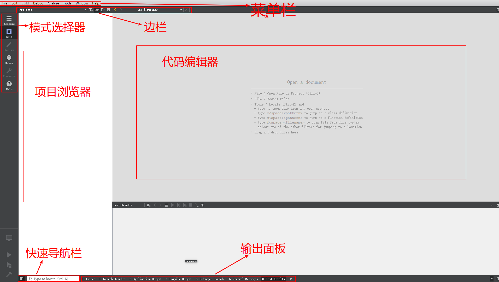

组成部分
========

Qt Creator主要由菜单(Menu Bar), 模式选择器(Mode Selectors), 项目浏览器(Project Inspector), 代码编辑器(Code Editor), 输出面板(Output Panes)，边栏(Sidebars)，快速导航面板(Quick Open Pane)等组件构成。

模式选择器(Mode Selectors)
--------------------------

Qt Creator有6种工作模式可供开发者选择，分别是：Welcome，Edit，Design，Debug，Projects和Help。

模式选择器允许开发者在处理不同任务时可以快速的切换工作模式，比如编辑代码，浏览帮助，设置编译器环境等。
当使用特定模式下才有的操作时，会自动切换到相应的模式，比如依次单击\ *菜单栏-> Debug -> Start Debugging*\ 时，Qt Creator将自动切换到Debug模式下。

欢迎模式(Welcome Mode)
~~~~~~~~~~~~~~~~~~~~~~

在欢迎模式下，可以快速的载入最近打开的会话或项目，查看示例或教程等。

编辑模式(Edit Mode)
~~~~~~~~~~~~~~~~~~~

在Edit模式下，可以编辑项目和源代码文件。

设计模式(Design Mode)
~~~~~~~~~~~~~~~~~~~~~

通过集成的Qt Designer设计GUI。

调试模式(Debug Mode)
~~~~~~~~~~~~~~~~~~~~

Qt Creator提供了多种不同的方式辅助程序员查看应用程序运行的状态来调试程序。

项目模式(Project Mode)
~~~~~~~~~~~~~~~~~~~~~~

在项目模式下，可以查看当前所有打开的项目的列表，并可以设置哪一个项目为当前的活动项目。

可以选定项目，针对构建(Build)，运行(Run)以及代码编辑器等多个方面进行详细设置。

帮助模式(Help Mode)
~~~~~~~~~~~~~~~~~~~

帮助模式，主要是无缝集成了Qt的文档和示例中的相关内容，可以不必另行打开Qt Assistant，就可以在Qt Creator的Help模式下查看文档和示例。

输出面板(Output Panes)
----------------------

Qt Creator的输出面板主要由7个子面板组成，分别是：

-  Issues

-  Search Results

-  Application Output

-  Compile Output

-  Debugger console

-  General Messages

-  Test Results

每种类型的信息在特定的面板中显示。

代码编辑器(Code Editor)
-----------------------

代码编辑器辅助开发者创建，编辑代码，并可在其间导航。它具有代码高亮，代码自动补全，上下文提示以及内嵌代码错误提示等特性。

-  属性设置

   可以选择\ *菜单栏 -> Tools -> Options -> Text Editor*\ ，来设置代码编辑器的各种属性。

-  快捷键

   Qt Creator的代码编辑器支持很多快捷键，可以在\ *菜单栏 -> Tools -> Options -> Environment -> KeyBoard*\ 中查看或自定义快捷键。

-  代码自动补全(Code Completion)

   当在代码编辑器中输入某个词组时，系统会自动弹出一个上下文窗口，里面列举了可能符合意图的完成代码，常见的自动补全的类别有：类，命名空间，方法，变量，宏，关键字等。

会话管理器(Session Managment)
-----------------------------

在Qt Creator中，一个会话(session)指的是一个用户与Qt Creator交互的一次过程，可以包括加载的项目，打开的文件以及代码编辑器的设置等等。

当运行Qt Creator时，就已经开启了一个对话，Qt Creator会将它记录下来。此外，可以通过\ *菜单栏 -> File -> Session -> Session Manager*\ 来创建和管理新的对话。
可以通过\ *菜单栏 -> File -> Session*\ 或在Welcome模式下切换会话。

Qt 帮助集成功能(Qt Help Integration)
------------------------------------

在Qt Creator中使用帮助，有两种主要的方式，一种是随时按下\ ``F1``\ 键，一种是切换到Help模式下，Qt Creator使用插件的方式将Qt的文档和示例集成进来。

Qt 设计师集成功能(Qt Designer Integration)
------------------------------------------

在使用Qt Creator开发应用程序时，常见的用法是用鼠标左键双击\ *.ui*\ 文件，即可打开Qt Creator的Qt Designer集成功能。
Qt Creator已经与Qt Designer完全集成在一起了。
这样就可以不用单独运行Qt Designer，在Qt Creator中完成应用程序界面设计，并且与Qt Creator的项目管理以及其它功能在一起获得对Qt项目的完整把握。
