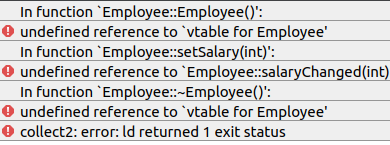

********************************************
Define a QObject derived class in .cpp file
********************************************

Qt的元对象系统对标准C++进行了扩展，增加了信号槽等功能。
如果我们自定义的类要使用Qt的信号槽机制，要继承\ ``QObject``\ 类，并在类定义的第一行添加\ ``Q_OBJECT``\ 宏。

.. code-block:: c++

    classs MyClass : public QObject  // 继承QObject
    {
    	Q_OBJECT  // 使用Q_OBJECT宏
    	...
    }

对于使用了Qt的元对象系统的代码, 在使用C++编译器编译之前，需要先使用Qt的\ ``moc``\ (**Meta Object Compiler, 元对象编译器**)进行处理，将其转换为标准C++兼容的形式，再由C++编译器进行编译。

通常，对于自定义的继承\ ``QObject``\ 的类，在\ ``.h``\ 中定义该类, 在\ ``.cpp``\ 中定义其实现.
在编译时, 需要先使用\ ``moc``\ 对Qt的扩展部分进行处理。
当使用\ ``qmake``\ 构建项目时，会自动的调用\ ``moc``\ 对\ ``.h``\ 进行处理, 处理后的\ ``.h``\ 文件被包含在\ ``.cpp``\ 文件中，
最终生成一个\ ``moc_***.cpp``\ 文件，C++编译器编译和链接的其实是该\ ``moc_***.cpp``\ 文件。

.. note::

	使用\ ``qmake``\ 时，会自动的调用\ ``moc``\ 对\ ``.h``\ 文件进行处理, 但是默认不会对\ ``.cpp``\ 文件进行处理.

如果自定义的类继承了\ ``QObject``\ , 但是类的定义不是在一个头文件中定义，而是在某个\ ``.cpp``\ 文件中，则编译时可能会报错。
这是因为使用\ ``qmake``\ 时，默认会调用\ ``moc``\ 对头文件进行处理，但是不会对\ ``.cpp``\ 文件进行处理；
\ ``.cpp``\ 文件中的扩展部分没有经过\ ``moc``\ 的处理就直接由C++编译器编译，从而产生编译时的错误。

例如，下面的\ ``Employee``\ 类，将其定义和实现都放在\ ``main.cpp``\ 中:

.. code-block:: cpp

	#include <QApplication>
	#include <QObject>

	class Employee : public QObject
	{
 		Q_OBJECT

   	public:
                Employee() { mySalary = 0; }
                int salary() const { return mySalary; }

	public slots:
                void setSalary(int newSalary)
                {
                        if (newSalary != mySalary) {
                                mySalary = newSalary;
                                emit salaryChanged(mySalary);
                        }
                }

	signals:
		void salaryChanged(int newSalary);

	private:
                int mySalary;
	};

	int main(int argc, char *argv[])
	{
    	        QApplication a(argc, argv);

    	        Employee e;
    	        e.setSalary(100);

    	        return a.exec();
	}

看起来似乎没有什么问题，但是编译时会报错:

原因就是因为\ ``Employee``\ 类在main.cpp中定义，使用\ ``qmake``\ 时\ ``moc``\ 没有对其中的扩展部分进行处理就直接由C++编译器编译了。

解决方法:

	* 将继承\ ``QObject``\ 的自定义类在一个\ ``.h``\ 文件中定义, 这样使用\ ``qmake``\ 时就会自动调用\ ``moc``\ 对该头文件进行处理

		在单独的头文件中定义自定义的类:

                .. code-block:: cpp

                	#ifndef EMPLOYEE_H
                	#define EMPLOYEE_H

                	#include <QObject>

                	class Employee : public QObject
	                {
                                Q_OBJECT

                	public:
                                Employee() { mySalary = 0; }
                                int salary() const { return mySalary; }

                	public slots:
                                void setSalary(int newSalary);

                	signals:
                                void salaryChanged(int newSalary);

                	private:
                                int mySalary;
	                };

                	#endif // EMPLOYEE_H

		在源文件中定义实现:

		.. code-block:: cpp

	        	#include "employee.h"

			void Employee::setSalary(int newSalary)
			{
                		if (newSalary != mySalary) {
                        	mySalary = newSalary;
                        	emit salaryChanged(mySalary);
        	        	}
			}

		在main.cpp文件中包含\ ``employee.h``\ :

                .. code-block:: cpp

	                #include <QApplication>
	                #include <QObject>

	                #include "employee.h"

	                int main(int argc, char *argv[])
	                {
    	                        QApplication a(argc, argv);

    	                        Employee e;
                            	e.setSalary(100);

                            	return a.exec();
                	}

        * 还有一种不太提倡的解决方法: 在\ ``.cpp``\ 文件的尾部，使用\ ``include``\ 包含\ ``moc``\ 处理后生成的\ ``moc_***.cpp``\ 文件

                如果没有\ ``moc_***.cpp``\ 这个文件, 则需要自己手动使用\ ``moc``\ 指令来生成。

        	.. code-block:: cpp

                	#include <QApplication>
                	#include <QObject>

                	class Employee : public QObject
	                {
 		                Q_OBJECT

   	                public:
                                Employee() { mySalary = 0; }
                                int salary() const { return mySalary; }

                	public slots:
                                void setSalary(int newSalary)
                                {
                                         if (newSalary != mySalary) {
                                                mySalary = newSalary;
                                                emit salaryChanged(mySalary);
                                         }
                                }

                	signals:
	                	void salaryChanged(int newSalary);

                	private:
                                int mySalary;
        	        };

	                int main(int argc, char *argv[])
	                {
    	                        QApplication a(argc, argv);

    	                        Employee e;
    	                        e.setSalary(100);

            	                return a.exec();
        	        }

                        #include "moc_main.cpp"  // 包含经过moc处理后的生成的文件

                手动生成\ ``moc_main.cpp``\ 的命令: ``moc main.cpp -o moc_main.cpp``

总结
====
为了避免不必要的错误, 同时作为一种好的编程实践，应该把类的定义放在一个头文件中, 把类的实现代码放在一个cpp文件中, 合理的进行拆分. 
